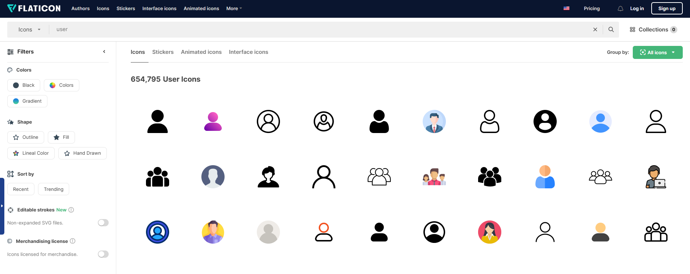
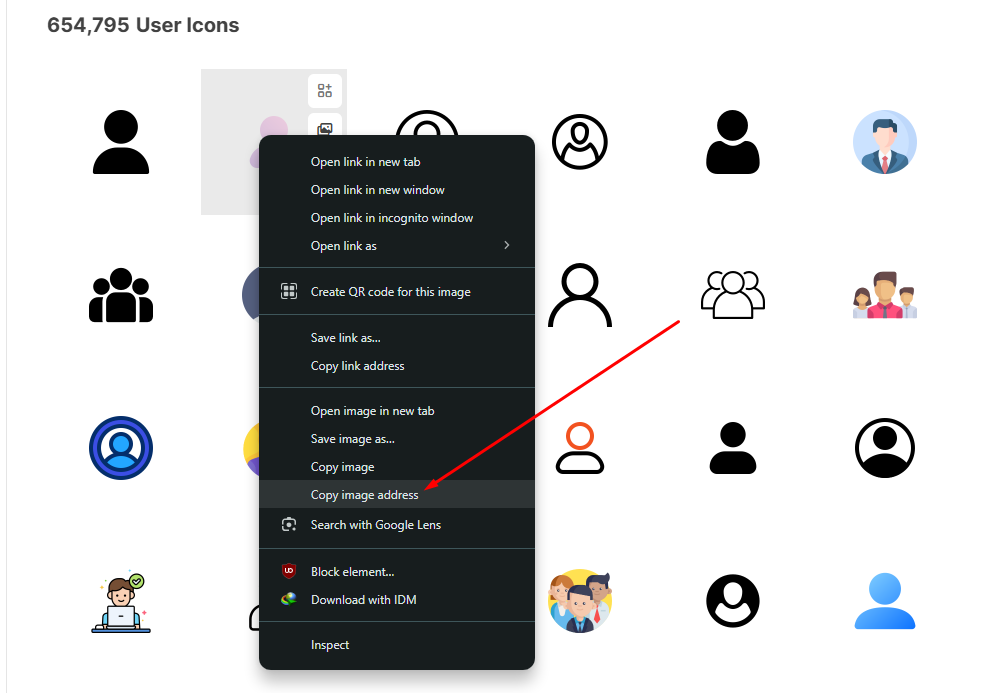

# flaticon কী?

আসসালামু আলাইকুম।

[flaticon](https://www.flaticon.com/) হচ্ছে জনপ্রিয় একটা সাইট যেখানে প্রয়োজনীয় বিভিন্ন আইকন খুঁজে ইউজ করা যায়। এখানে SVG, PNG ইত্যাদি ফরম্যাটে আইকন পাওয়া যায় — যদিও বিনামূল্যে PNG ডাউনলোডের জন্য অনেক সময় সাইন ইন বা ডেইলি একটা লিমিটেশনের শর্ত থাকে।

## ধাপে ধাপে কীভাবে flaticon থেকে PNG ডাউনলোড করবেন?

এখানে সহজ পদ্ধতিতে দেখানো হলো কীভাবে আপনি সরাসরি কোনো PNG ফাইল ডাউনলোড করতে পারেন IDM বা `wget` দিয়ে।

---

### ✅ ধাপ ১: flaticon-এ গিয়ে আইকন সার্চ করুন

প্রথমে [flaticon.com](https://www.flaticon.com/) এ যান এবং আপনি যেই ধরণের আইকন খুঁজছেন, সেটা সার্চ বক্সে লিখে সার্চ দিন।

উদাহরণ:  



---

### ✅ ধাপ ২: পছন্দের আইকনের ওপর রাইট ক্লিক করে Image Address কপি করুন

যে আইকনটি আপনি PNG হিসেবে ডাউনলোড করতে চান, সেটার ওপর মাউসের **রাইট ক্লিক** করুন এবং **“Copy image address”** এ ক্লিক করুন।



> আপনি চাইলে নতুন ট্যাবে ছবিটা খুলে সেখান থেকেও লিংক কপি করতে পারেন।


---

### ✅ ধাপ ৩: আইকন ডাউনলোড করুন

#### 🔸 ব্রাউজার দিয়ে ডাউনলোড
- লিঙ্ক নতুন ট্যাবে ওপেন করে বা পেস্ট করে দিন।
- > লিঙ্ক এরকম দেখাবে `https://cdn-icons-png.flaticon.com/128/15181/15181334.png`

- > এখান থেকে `128` পরিবর্তন করে `528` করে দিলে হাই কোয়ালিটি ইমেজ পাবেন।
- মাউসের **রাইট বাটনে** ক্লিক করে সেইভ করে নিন পছন্দের ফোল্ডারে।

#### 🔸 IDM দিয়ে ডাউনলোড:

- IDM-এ গিয়ে **“Add URL”** অপশনে কপি করা লিংকটা পেস্ট করে ডাউনলোড দিন।

#### 🔸 wget দিয়ে ডাউনলোড (Linux/macOS বা Windows-এর Git Bash):

টার্মিনালে নিচের কমান্ডটি লিখুন (লিঙ্ক আপনার পছন্দ করা ওইটা দিবেন):

```bash
wget "https://cdn-icons-png.flaticon.com/512/15181/15181334.png
```

আশা করছি আর্টিকেলটি আপনাদের উপকারে এসেছে, জাযাকুমুল্লাহু খইরন।